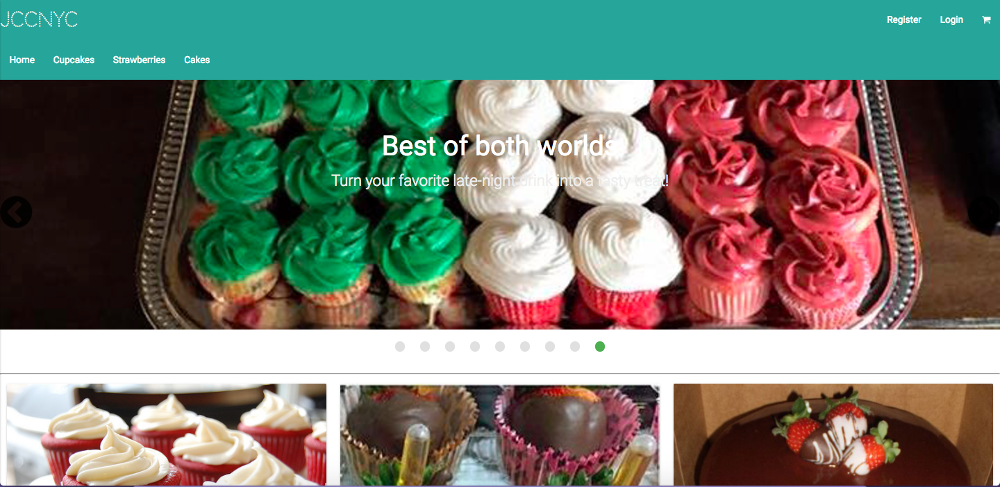
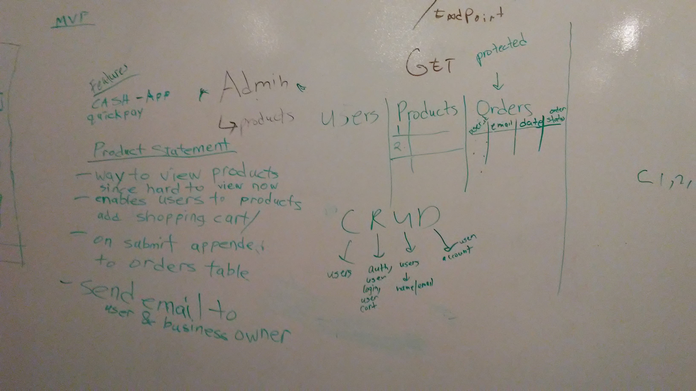

# Joe's Cocktail Confections Website

### Screenshot:
  

#### [Link to Live Site](https://pacific-savannah-99868.herokuapp.com/)  
#### [Link to Repo](https://github.com/franklinbrooks/Joes-Cocktail-Confections)  
#### [Link to ZenHub](https://github.com/franklinbrooks/Joes-Cocktail-Confections/issues/1#boards?repos=80679483)  

#### [Link to Trello](https://trello.com/b/hEVqZmX5/joes-cocktail-confections)

### About The Project
A couple paragraphs about the general approach.
Who are users, what do they want, and why?

In the world of confectionary arts, there is a Harlem-born entrepreneur looking for a way to make it easier to organize and record his orders as well as easier for his customers to make orders. Currently, the only web presence for this business owner consists of social media sites (i.e. instagram and facebook) where his clientele places orders through calling him directly.  This is where our team stepped in to assist with this endeavor and help a local NYC business owner.  As lovers of baked goods ourselves, our team set out to share that love by building a website as an extension to his brand and to showcase his work.  What makes his business unique?  His specialties are alcohol infused baked goods and custom-made to user specification.  Our efforts were focused on giving his current customer base an easier way to view his products and make orders. As more features are added, it could possibly grow his traffic, lead volume, and increase his customer base.


Our approach for this website was to build for mobile first since majority of customers are reached on the go, as he markets his brand at social after-hour events. The targeted users are extroverted people who like to host social gatherings and events. These users need a quick way to view product offerings and have a visual representation of those products.  We knew a visually stunning design was key for a product such as this. The website had to present his products on its own with

An online presence outside of Facebook and Instagram means a product has entice users on its own without the to present on its own


### Wireframes for project:
  


### Technologies Used
- HTML
- CSS
- JavaScript
- jQuery
- Express.js
- Postgres SQL
- Sass CSS
- Materialize
- Serialize ORM
- Bcrypt
- Moment.js
- Nodemailer


### Installation instructions for dependencies
This project includes a package.JSON file which provides details for the above dependencies and others.  These files are imported into the node_modules folder by Node Package Manager. One Ruby gem enables transpiling of Sass to CSS.  Finally, Font-Awesome and Materialize-CSS are linked via CDN.

- Download or clone repo.
- Run npm install in terminal.
- Run npm start from terminal.

### Code Example: Creating an Order
When the newOrder route is requested, user's log in status is checked. Upon authentication, user's order is added to their own personal shopping cart. The create order portion of new order route creates a record in the order table.

```javascript
/* Creating Order - Add to Order Button  */
router.post('/newOrder', authHelpers.loginRequired, (req, res, next)  => {
  orderHelpers.createOrder(req, res)
  .then((order) => {
      res.redirect('/order');
    })
    .catch((err) => { res.status(500).json({ status: 'error' });
  })
});


````
### Build Strategy
 
The above pictures show the features we wanted to have in website as well as the table structure in the planning phrase.

In the beginning stages, we planned out our back-end structure and laid out how many tables we needed to facilitate the functionality we wanted to implement.From there, we decided on the necessary columns for each table and how each table would be related to each other. 

As previously stated, our approach for this website was to build for mobile first therefore, we picked design attributes that would work for web as well as mobile. We decided to use Materialize and Sass to help with this task. Of course, we can’t forget Font-Awesome since pictures say a thousand words why not have icons!

Before writing a single line of code, we front-loaded all our dependencies that we felt we needed to carry out the four major features we wanted to implement in the app.  Besides having full CRUD on one of our tables, the four main features are:
-An easier way to view each product
-Enable users to add products to a shopping cart
-On order submittal have items in shopping cart append to order table
-Send email to user and business owner upon order submittal
Each feature built upon the next and was given a level of importance.  We successfully met the four things we set out to accomplish through collaborative teamwork by aid of Screenhero and side-by-side.


### Contributing
This project was developed as part of the Web Development Immersive program at General Assembly in NYC, February 2017. Our mentors for this build were Kate, Ariana, Joe, and Vince. Thanks, all!

### Minimum Viable Product
- Use PostgreSQL & Express to build full stack web app
- Should include TWO related models, one of which should be a user model.
- Include all major CRUD functions for at least one of those models
- Add an Authentication layer to your app to restrict access to appropriate users
- Craft thoughtful user stories together as a team, displaying them on a ZenHub board
- Manage team contributions and collaboration using the Git workflow
- Layout and style your front-end, so that is Responsive and uses a CSS Framework
- Deploy your application online so it's publicly accessible

### Improvements on MVP
- When user places an order it sends an email to customer and business owner that the order has been placed. We implement this functionality with Nodemailer.

### Unsolved problems or major hurdles team had to overcome
- We had to build the database in the beginning and make small additions to the database as we realized more information was needed. We learned how important that planning
step in building the back-end was in this project. We overcame that challenge and even added additional columns for future applications.
- Working on way to allow user to update password so that it goes through hashing process again

### Possible Future Improvements
In no particular order, we would like to add:
  1. Addition of User invoicing via third-party payment API
  2. User will be able to review past order history by delivery dates.
  3. Add Status updates for orders through implementation of SMS services like Twilio, etc.
  4. Ability for Admin login
  5. Add web object meta tags to header for SEO functionality
  

### Authors
  [Shantel Moore](moore.shantel@gmail.com)   
  [Dominic Farquharson](farquharsondominic@gmail.com)    
  [Franklin Brooks](fcb@franklinchristopherbrooks.com)
